# STRATO Mercata Token Standards

Welcome to the STRATO Mercata Token Standards repository, where we are pioneering the future of blockchain asset management. Our token standard is not just an innovation—it's a revolution in how real-world assets (RWAs) are handled on the blockchain.

## Overview

The STRATO Mercata standards introduce a UTXO-based token model that advances traceability, security, and scalability. With our unique Sale contract feature, users can transfer assets securely while maintaining complete control over their transactions.

## Features

- **Assets**: Manages real world assets with granularity.
- **Enums**: Enumerated types that define a set of named constants for better code clarity.
- **Orders**: Create and manage sales with ease, thanks to our intuitive structuring.
- **Payments**: Secure and streamlined payment structures for efficient transaction processing.
- **Sales**: Sale contract mechanism that facilitates secure trading of RWAs and ownership transfer of assets.
- **Utils**: A collection of utility functions and libraries to assist in smart contract development.

## Groundbreaking Benefits

- Enhanced **Traceability**: Track the lifecycle of each asset with a transparent and unalterable ledger.
- Increased **Security**: Conduct transactions with the confidence that comes from robust cryptographic standards.
- Improved **Liquidity**: Realize the true value of your assets with flexible and liquid market structures.
- **Scalability**: Our UTXO-based model is designed to handle a high volume of transactions without compromising speed or reliability.

## Getting Started

To get started with STRATO Mercata Token Standards, clone this repo and dive into our comprehensive documentation available in the `STRATO Mercata Token Standards.pdf`. We have also uploaded presentation slides and a demo video:`Mercata_Demo.mp4`(Skip to 16:18 for contracts).

## Presentation

 

 

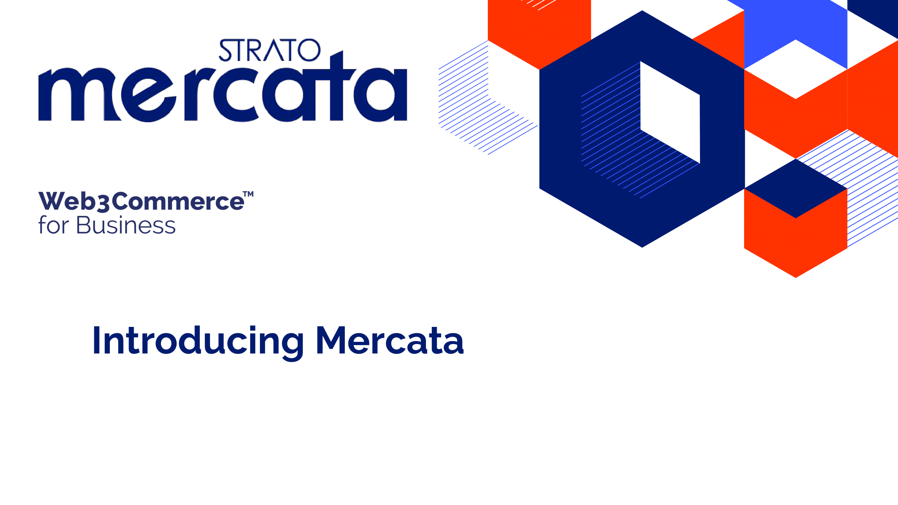
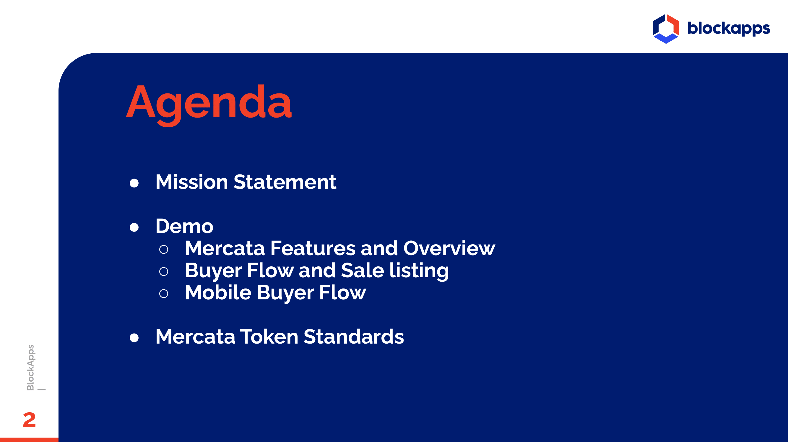
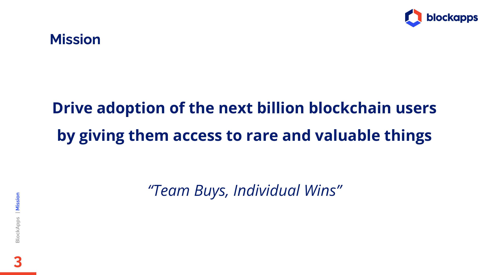
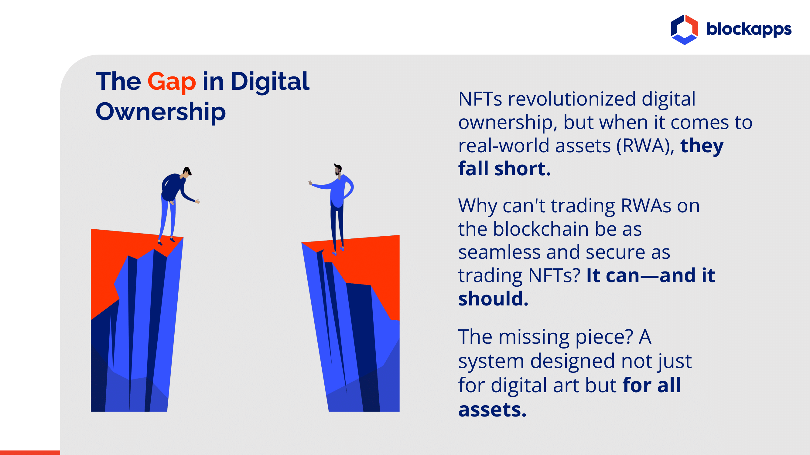
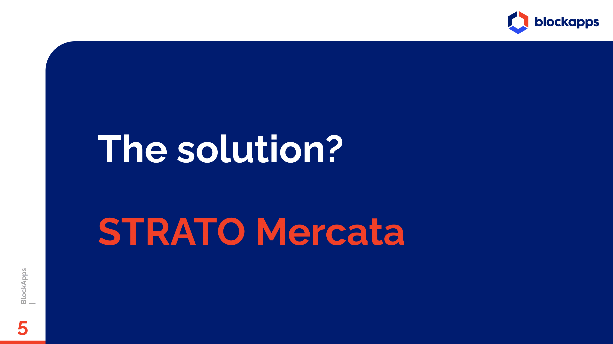
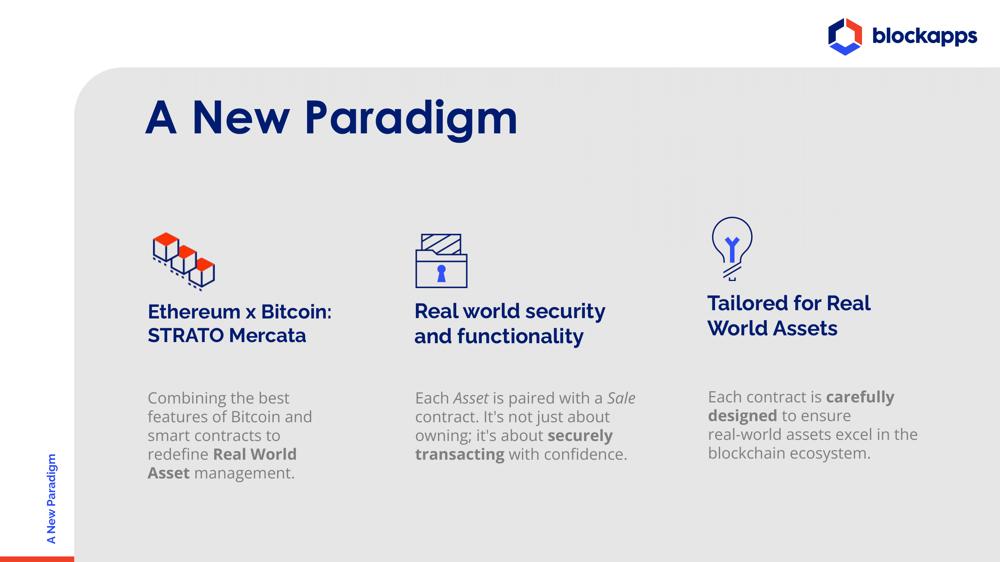
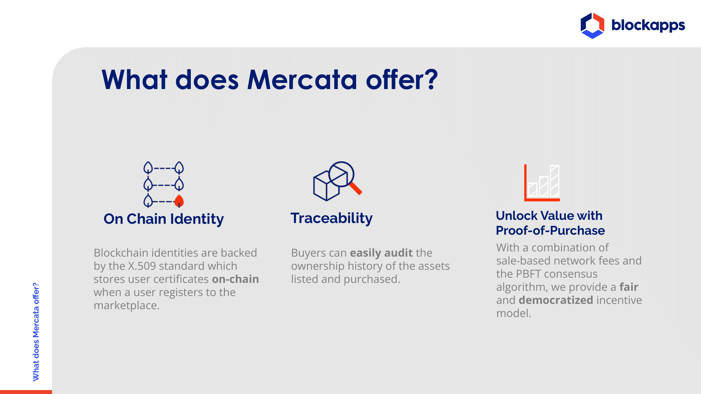
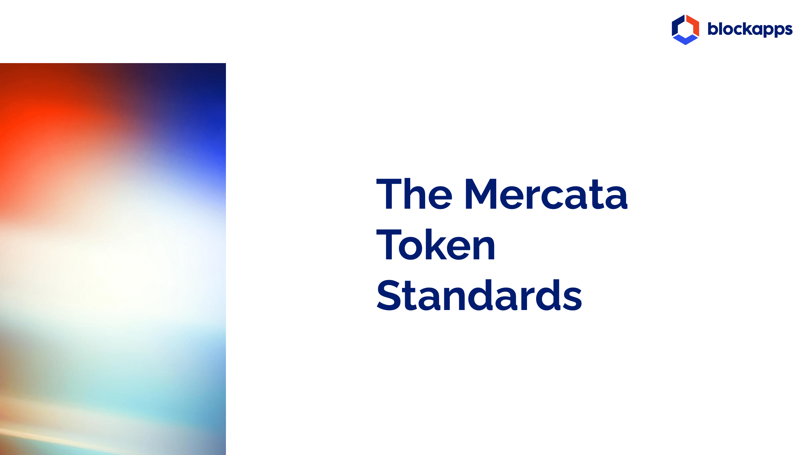
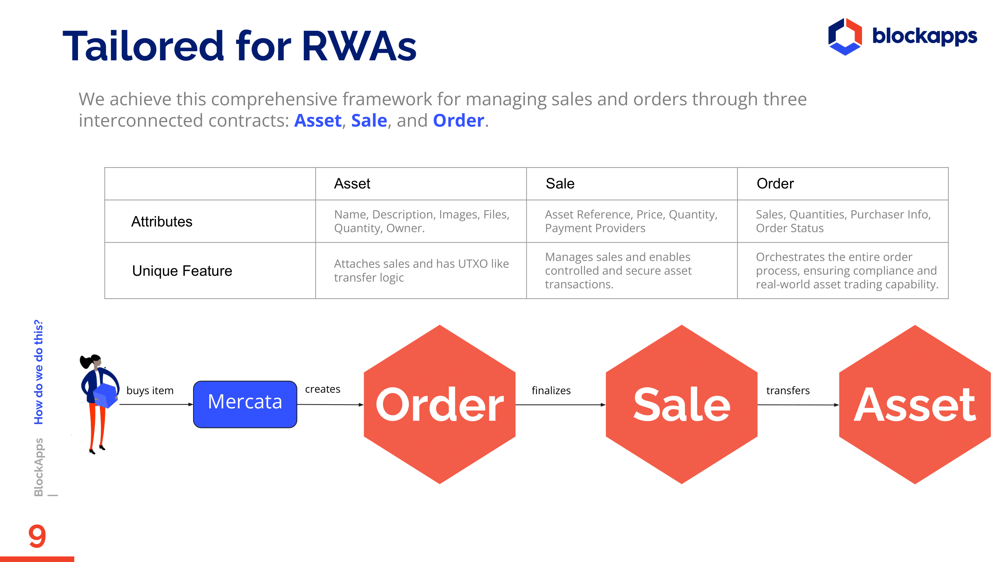
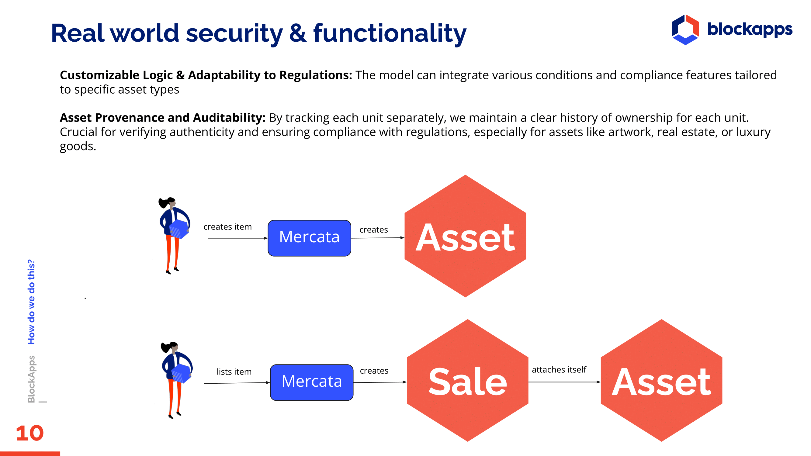
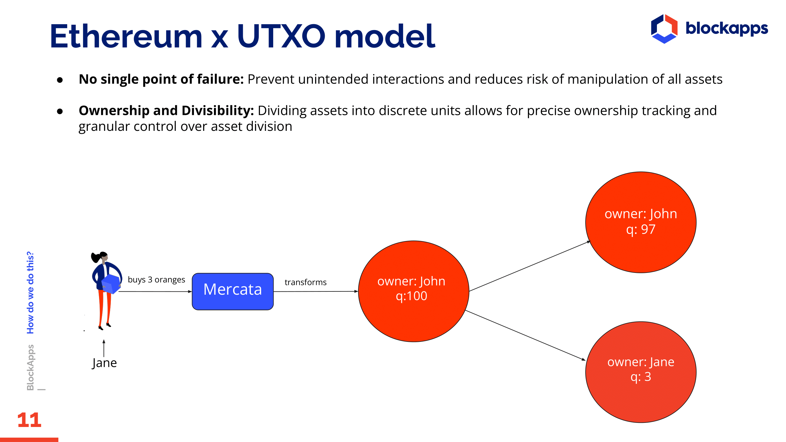
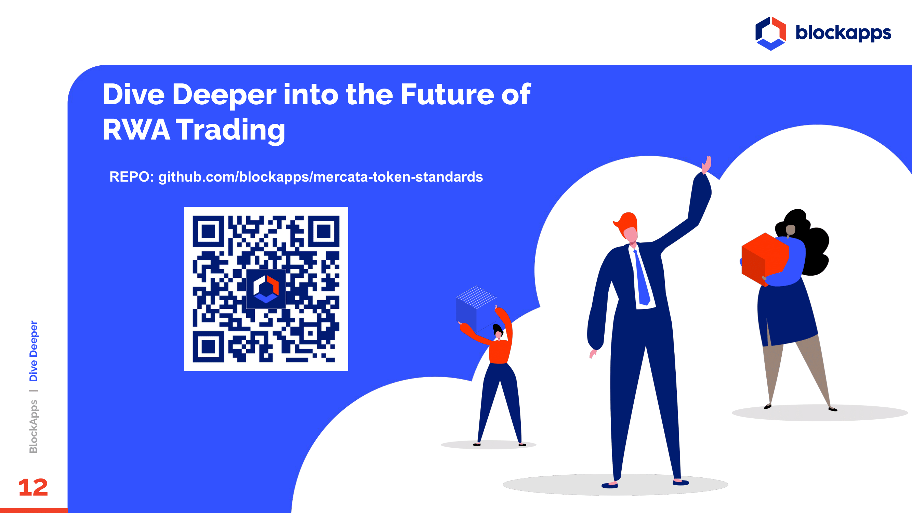

## Contribution

We welcome contributions from the community! If you're interested in being part of this groundbreaking project, please read through our `LICENSE` and submit your pull requests for review.

## Contact

For more information, issues, or general inquiries regarding the STRATO Mercata Token Standards, please open an issue or contact our team:
david_nallapu@blockapps.net

Thank you for your interest in STRATO Mercata Token Standards. Let's build the future of asset management on the blockchain together!

Copyright [2024] [BlockApps Inc.]

Licensed under the Apache License, Version 2.0 (the "License");
you may not use this file except in compliance with the License.
You may obtain a copy of the License at

    http://www.apache.org/licenses/LICENSE-2.0

Unless required by applicable law or agreed to in writing, software
distributed under the License is distributed on an "AS IS" BASIS,
WITHOUT WARRANTIES OR CONDITIONS OF ANY KIND, either express or implied.
See the License for the specific language governing permissions and
limitations under the License.